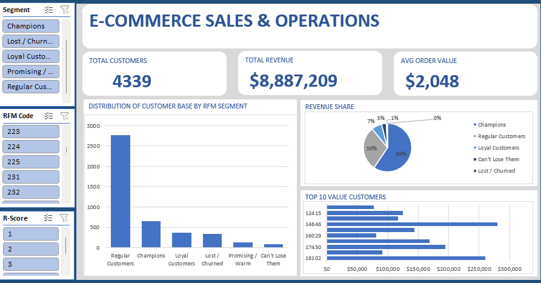

# E-Commerce RFM Sales & Operations Dashboard

## Project Overview
This project features an interactive Excel dashboard designed to analyze and segment a customer base of 4,339 records using the **RFM (Recency, Frequency, Monetary)** framework. It transforms complex transactional data into high-level, executive-ready insights.

## Live Dashboard Preview

## Key Insights Revealed
* **The Pareto Effect:** While "Champions" make up a small fraction of the total customer headcount, they drive **59% of total business revenue**.
* **Volume vs. Value:** "Regular Customers" represent the highest volume of accounts but a much lower share of overall wallet spend, highlighting key areas for targeted promotional shifting.
* **High-Value Retention:** The dashboard isolates top-tier VIP accounts (such as Customer ID 14646) to ensure customer success teams can actively prioritize high-value retention.

## Features & Tech Stack
* **Excel Pivot Tables & Pivot Charts:** Built the backend analytical architecture.
* **Dynamic KPI Summary Cards:** Programmed unified, live cell blocks showing Total Customers, Total Revenue, and Average Order Value.
* **Interactive Filter Panel:** Connected multi-slicer controls (`Customer Segment`, `Recency Score`, and `RFM Code`) for real-time deep dives.
